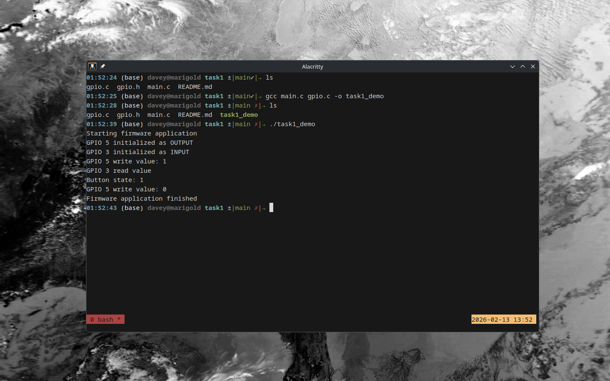

# Task Submission: Firmware Libraries & APIs
**Name:** David Frisbee
**Date:** 2026-02-13

## 1. What is a Firmware Library?
A firmware library is portions of code pre-written to abstract low-level hardware details. These often cover core features and capabilities of a device such as timers, ADCs and GPIOs, and are important for easy reusability. It makes no sense for every team that uses a device to replicate the same work. 

## 2. Why are APIs important in Embedded Systems?
APIs are even more important in embedded systems that will be relied up for critical tasks. It allows a seperation of the driver from the app logic, and either one can be improved or fixed independently without affecting the other. This allows developers to write software that works on a number of devices, or device makers to make driver software work with pre-existing user applications. It also helps with scalability, by making very common tasks simpler and reducing overhead. 

## 3. Lab Code Analysis

The lab code demonstrated how an api and implementation can be seperated from the main code and how this looks in operation. The code initializes and operates a couple of sample gpio pins as a button and led.

## 4. Proof of Work

